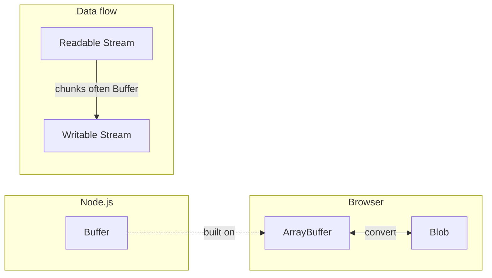
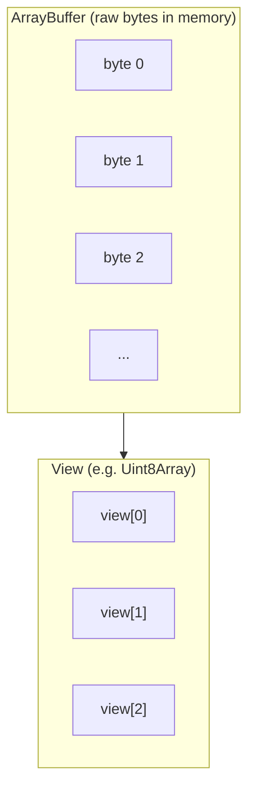
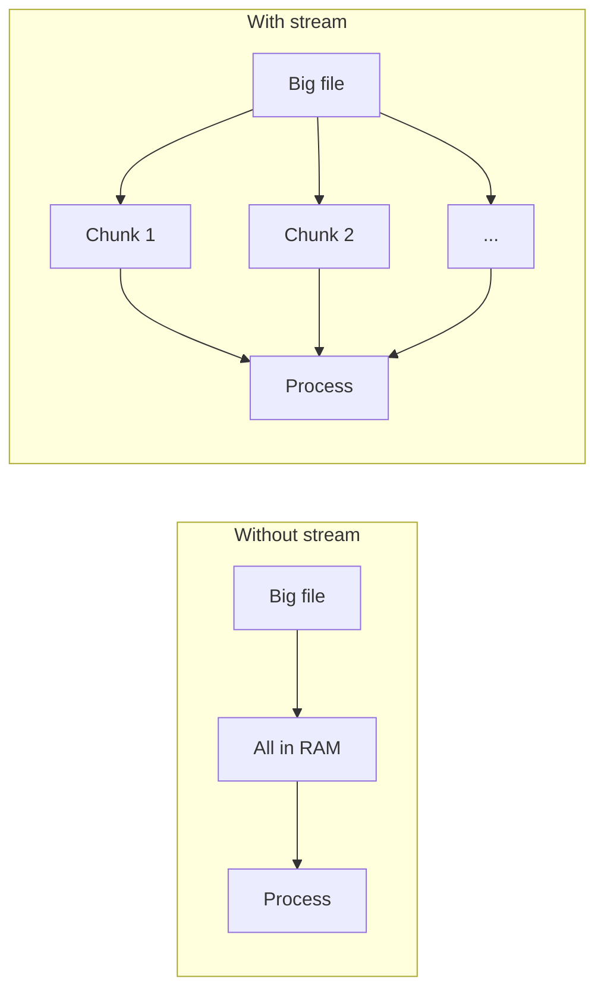

# Binary Data in JavaScript: ArrayBuffer, Blob & Streams

A short guide to working with raw bytes and chunked data in JavaScript. Written for junior developers.

---

## The Big Picture

When you work with files, images, or network data, you often deal with **binary data** (raw bytes) instead of text. JavaScript gives you a few tools for this.

### How the pieces fit together



### Quick reference table

| Concept        | Where        | In simple terms |
|----------------|-------------|------------------|
| **ArrayBuffer**| Browsers & Node | A fixed-size block of raw bytes. You need a **view** to read or write it. |
| **Buffer**     | Node.js only | Node’s way to work with bytes. Built on ArrayBuffer; used for files and network. |
| **Blob**       | Browsers (mainly) | Binary data + a type (e.g. image/jpeg). Used for downloads, uploads, `fetch`. |
| **Stream**     | Node.js (and Web) | Data that moves **in chunks** over time instead of loading everything into memory. |

### Where to use what

| Environment | Binary data you’ll use most | Also useful |
|-------------|----------------------------|-------------|
| **Browser** | Blob, ArrayBuffer           | FileReader, fetch, canvas |
| **Node.js** | Buffer, Streams             | ArrayBuffer when an API expects it |

**Important:** In **Node.js** you’ll use **Buffer** most of the time for files and network. **Blob** is mainly a **browser** API. **ArrayBuffer** is the low-level standard in both.

---

## ArrayBuffer

### What is it?

An **ArrayBuffer** is a fixed-length block of memory that holds **raw bytes** (each byte is a number 0–255). You **cannot** read or write it directly; you use a **view** (e.g. `Uint8Array` or `DataView`) to work with the bytes.

### ArrayBuffer + View (concept)



Think of it like this: the **ArrayBuffer** is the raw storage; the **view** is the “lens” you use to read or change it.

### Why use it?

| Reason | Meaning |
|--------|---------|
| **Binary data** | Files, images, network packets, custom formats are bytes. |
| **Efficient** | Better for large data than normal JavaScript arrays. |
| **Low-level control** | You decide exactly how bytes are laid out and read. |

### Important details

| Point | Explanation |
|-------|-------------|
| **Fixed size** | Once created, the length doesn’t change. |
| **No direct access** | Always use a view (TypedArray or DataView). |
| **Compact** | Stores data as raw bytes, not as JS objects. |

### Basic example

```javascript
// Create a buffer of 16 bytes
const buffer = new ArrayBuffer(16);

// Use a view to read and write (Uint8Array = one number 0–255 per byte)
const view = new Uint8Array(buffer);

view[0] = 42;           // write first byte
view[1] = 255;          // write second byte
console.log(view[0]);   // 42
console.log(view[1]);   // 255
```

**What’s in memory (simplified):**  
`[42, 255, 0, 0, 0, 0, 0, 0, 0, 0, 0, 0, 0, 0, 0, 0]` — the rest are 0 by default.

### View types (table)

| View           | Bytes per item | Value range (unsigned) | When to use |
|----------------|----------------|-------------------------|-------------|
| **Uint8Array** | 1              | 0 – 255                 | Single bytes (e.g. image pixels, raw file data) |
| **Uint16Array**| 2              | 0 – 65,535              | Short integers |
| **Uint32Array**| 4              | 0 – 4,294,967,295       | Integers |
| **DataView**   | Any (you choose) | Depends on method     | Mixed types or custom byte positions (e.g. read Int16 at offset 4) |

### Where ArrayBuffer shows up

- Reading/writing files (browser: FileReader; Node: often via Buffer).
- Images (canvas, processing).
- Network: e.g. `fetch` → `response.arrayBuffer()`.
- Audio/video, crypto, compression.

---

## ArrayBuffer vs Buffer in Node.js

| Aspect        | ArrayBuffer        | Buffer (Node.js)        |
|---------------|--------------------|--------------------------|
| **Standard**  | JavaScript (browser + Node) | Node.js only      |
| **Built on**  | —                  | ArrayBuffer / Uint8Array |
| **Size**      | Fixed at creation  | Can grow (e.g. concat)   |
| **Where you get it** | `response.arrayBuffer()`, `FileReader` | `fs.readFile()`, `http` responses |
| **When to use** | When API expects raw bytes | Default for file & network in Node |

In Node, use **Buffer** for file and network binary data. Use **ArrayBuffer** when an API expects it (e.g. some crypto or Web APIs).

---

## Blob (Browser / Web API)

**Blob** in the browser is a **wrapper for binary data** that can have a **MIME type** (e.g. `image/jpeg`, `application/pdf`). It’s used for downloads, uploads, `fetch`, and `FileReader`.

| Property    | Details |
|------------|---------|
| **Immutable** | You create it; you don’t change it in place. |
| **Works with** | `fetch`, `FileReader`, `FormData`, file inputs, downloads. |

**Don’t mix up:**

| Term   | Meaning |
|--------|---------|
| **Blob** (Web API) | Browser object: binary data + MIME type. |
| **BLOB** (database) | Column type in DBs for storing large binary data. |

### Blob ↔ ArrayBuffer (conversion)

```mermaid
flowchart LR
    A[Blob] -->|blob.arrayBuffer()| B[ArrayBuffer]
    B -->|new Blob([arrayBuffer], type)| A
```

**Code:**

```javascript
// Create a Blob from text
const blob = new Blob(["hello"], { type: "text/plain" });

// Blob → ArrayBuffer (async)
const arrayBuffer = await blob.arrayBuffer();

// ArrayBuffer → Blob
const blob2 = new Blob([arrayBuffer], { type: "application/octet-stream" });
```

### Example: download a string as a file (using Blob)

```javascript
// Build some content (e.g. CSV text)
const csvContent = "name,age\nAlice,30\nBob,25";

// Wrap in a Blob with a type
const blob = new Blob([csvContent], { type: "text/csv" });

// Create a temporary URL for the Blob
const url = URL.createObjectURL(blob);

// Trigger download
const a = document.createElement("a");
a.href = url;
a.download = "export.csv";
a.click();

// Clean up the URL when done
URL.revokeObjectURL(url);
```

---

## Real-World Uses

Where binary data (ArrayBuffer/Buffer) typically appears:

| Use case | Browser | Node.js |
|----------|---------|---------|
| Binary files (images, PDFs) | FileReader → ArrayBuffer; or fetch → arrayBuffer() | `fs.readFile()` → Buffer |
| HTTP / fetch | `response.arrayBuffer()` or `response.blob()` | Request/response body as Buffer or stream |
| WebSockets | Binary frames as ArrayBuffer/Blob | Frames as Buffer |
| Crypto / hashing | Crypto API (ArrayBuffer) | `crypto` module (Buffer) |
| Custom formats (ZIP, etc.) | Parse ArrayBuffer | Parse Buffer; `zlib` uses Buffer |

**Example – Node: read file and hash it:**

```javascript
const fs = require("fs");
const crypto = require("crypto");

const data = fs.readFileSync("file.txt");  // Buffer
const hash = crypto.createHash("sha256").update(data).digest();
```

**Example – Browser: download a PDF from a URL:**

```javascript
const response = await fetch("https://example.com/file.pdf");
const blob = await response.blob();
const url = URL.createObjectURL(blob);
// e.g. open in new tab: window.open(url);
// or use <a download> as in the CSV example above
URL.revokeObjectURL(url);  // when done
```

---

## Streams in Node.js

**Streams** let you handle data **in chunks** as it arrives or is sent, instead of loading it all into memory.

### Without streams vs with streams

| Without streams | With streams |
|-----------------|--------------|
| Load entire 1 GB file into RAM | Read e.g. 64 KB at a time |
| High memory use, can crash on big files | Lower memory use, can handle huge files |
| Wait for full file before processing | Start processing as soon as first chunk arrives |



### Four kinds of streams

| Type         | Direction | Example |
|-------------|-----------|---------|
| **Readable** | You read from it | File read stream, HTTP request body |
| **Writable** | You write to it | File write stream, HTTP response |
| **Duplex**   | Read and write | TCP socket, WebSocket |
| **Transform**| Read → change → write | gzip, JSON parser |

### How piping works

```mermaid
flowchart LR
    A[Readable Stream\n e.g. file] -->|.pipe()| B[Writable Stream\n e.g. file or response]
```

Data flows from the readable stream to the writable stream automatically; you don’t have to move chunks by hand.

### Stream examples

**1. Read a large file in chunks**

```javascript
const fs = require("fs");
const readStream = fs.createReadStream("large-video.mp4");

readStream.on("data", (chunk) => {
  console.log("Chunk size:", chunk.length, "bytes");
});

readStream.on("end", () => {
  console.log("Finished reading");
});
```

**2. Copy a file (pipe)**

```javascript
const fs = require("fs");
fs.createReadStream("input.txt").pipe(fs.createWriteStream("output.txt"));
```

**3. Send a file over HTTP**

```javascript
const http = require("http");
const fs = require("fs");

http.createServer((req, res) => {
  fs.createReadStream("big-file.pdf").pipe(res);
}).listen(3000);
```

**4. Compress a file on the fly**

```javascript
const fs = require("fs");
const zlib = require("zlib");

fs.createReadStream("input.txt")
  .pipe(zlib.createGzip())
  .pipe(fs.createWriteStream("input.txt.gz"));
```

### Main ideas (table)

| Idea | Meaning |
|------|---------|
| **Chunks** | Process a little at a time to save memory. |
| **Backpressure** | If the writer is slow, the reader can pause so nothing overflows. |
| **`.pipe()`** | Connects readable → writable so data flows automatically. |
| **Events** | Use `data`, `end`, `error` to react to the stream. |

### When to use streams

- Large files (videos, logs, backups).
- HTTP request/response bodies, WebSockets, database result streams.
- Real-time data (logs, sensors).
- Any time you want to process or transform data as it flows (e.g. compress, parse).

---

## Quick Reference

| Term | One line |
|------|----------|
| **ArrayBuffer** | Raw bytes, fixed size; use a **view** to read/write. |
| **Buffer** | Node’s binary type; use for files and network in Node. |
| **Blob** | Browser binary + MIME type; use for downloads, uploads, fetch. |
| **Stream** | Data in chunks over time; use for large or continuous data. |

**Environment summary:**

- **Browser** → think **ArrayBuffer** and **Blob**.
- **Node.js** → think **Buffer** and **Streams** for most binary and file work.
