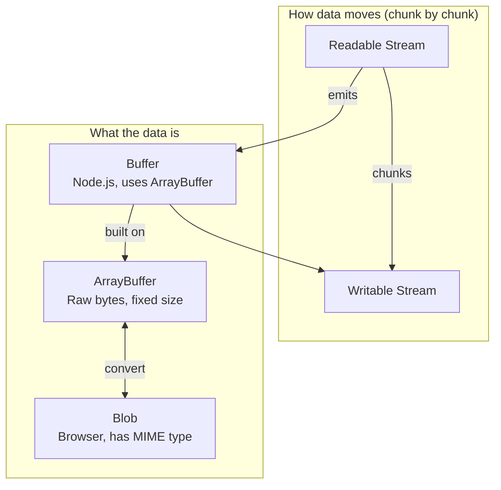

# ArrayBuffer in JavaScript

## Overview: ArrayBuffer, Blob & Stream



| Concept         | Role                                                                                         |
| --------------- | -------------------------------------------------------------------------------------------- |
| **Stream**      | Moves data in chunks (read/write over time). Does not hold everything in memory.             |
| **ArrayBuffer** | Raw block of bytes. Low-level; you need a view (e.g. Uint8Array) to read/write.              |
| **Buffer**      | Node.js type for binary data. Built on ArrayBuffer; used as stream chunks.                   |
| **Blob**        | Browser type for binary data with a type (e.g. image/jpeg). Can convert to/from ArrayBuffer. |

---

### How They Relate (IMPORTANT 🔴)

| Term            | Where       | Purpose                             |
| --------------- | ----------- | ----------------------------------- |
| **ArrayBuffer** | JS standard | Raw fixed-size bytes                |
| **Buffer**      | Node.js     | Raw bytes with extra helpers        |
| **Blob** (Web)  | Browsers    | Wrapper for binary data + MIME type |
| **BLOB** (DB)   | Databases   | Column type for large binary values |

> In Node.js you usually use **Buffer**; **Blob** is mostly a browser API. Node.js has added Blob support in recent versions (e.g. for `fetch`), but Buffer is still the common choice for file and network handling.

---

## What is ArrayBuffer?

ArrayBuffer is a JavaScript object that represents a fixed-size chunk of memory. Think of it as a raw block of bytes (numbers from 0 to 255) that you can use to store binary data.

## Why use ArrayBuffer?

- **Raw binary data**: When you need to work with files, images, network data, or any binary format
- **Performance**: More efficient than regular arrays for handling large amounts of data
- **Low-level control**: Gives you direct access to memory bytes

## Key Points

1. **Fixed size**: Once created, you cannot change the size of an ArrayBuffer
2. **Cannot read directly**: You cannot read or write to ArrayBuffer directly - you need a "view" (like TypedArray or DataView)
3. **Memory efficient**: Stores data in a compact binary format

## Basic Example

```javascript
// Create an ArrayBuffer with 16 bytes (128 bits)
const buffer = new ArrayBuffer(16);

// To work with the buffer, you need a view
// Uint8Array treats each byte as a number from 0-255
const view = new Uint8Array(buffer);

// Now you can read and write
view[0] = 42; // Set first byte to 42
console.log(view[0]); // Read first byte: 42
```

## Common Views

- **Uint8Array**: Each element is 1 byte (0-255)
- **Uint16Array**: Each element is 2 bytes (0-65535)
- **Uint32Array**: Each element is 4 bytes (0-4294967295)
- **DataView**: Flexible view that lets you read/write different data types at any offset

## Real-world Use Cases

- Reading/writing files
- Working with images (canvas, image processing)
- Network protocols (WebSockets, fetch API)
- Audio/video processing
- Cryptography operations

---

## Real-world Use Cases for ArrayBuffer in Node.js

Here are common real-world situations where **ArrayBuffer** is used in Node.js:

### 1. Binary File Handling

When working with files that aren't plain text: images, audio, video, executables.

```javascript
// Reading an image file
const fs = require("fs");
const buffer = fs.readFileSync("photo.jpg");
// buffer is a Buffer (which uses ArrayBuffer under the hood)
// You might pass it to an image processing library or send it over HTTP
```

### 2. Network APIs and HTTP

Parsing or sending binary data over the network.

```javascript
// Fetching binary data from an API
const response = await fetch("https://api.example.com/file.pdf");
const arrayBuffer = await response.arrayBuffer();
// Process or save the PDF bytes
```

### 3. WebSockets

Sending and receiving binary frames (e.g. images, compressed data, custom protocols).

```javascript
// Receiving binary data over WebSocket
ws.on("message", (data) => {
  if (data instanceof Buffer) {
    // data is binary - could be an image, game state, etc.
  }
});
```

### 4. Crypto and Hashing

Cryptographic operations work on raw bytes (passwords, hashes, signatures).

```javascript
const crypto = require("crypto");
const data = Buffer.from("sensitive data");
const hash = crypto.createHash("sha256").update(data).digest();
// hash is a Buffer containing raw bytes
```

### 5. Parsing Custom Binary Formats

Protocols and formats that define their layout in bytes:

- Custom binary protocols
- Parsing ZIP, PDF, MP3 headers
- Game save formats
- IoT device protocols

### 6. Database Drivers

Drivers for databases like MongoDB, PostgreSQL often use Buffers/ArrayBuffer for:

- Binary types (BLOB, binary columns)
- Binary protocol encoding
- Large binary fields

### 7. Streaming Media

Processing audio/video streams, transcoding, or piping media data.

### 8. Data Compression / Decompression

`zlib` and similar libraries work on raw bytes for compression and decompression.

```javascript
const zlib = require("zlib");
const input = Buffer.from("data to compress");
const compressed = zlib.gzipSync(input);
// compressed is a Buffer
```

---

## ArrayBuffer vs Buffer in Node.js

- **ArrayBuffer** – Low-level, fixed-size raw binary buffer (JavaScript standard).
- **Buffer** – Node.js type built on top of `Uint8Array`/ArrayBuffer, with extra helpers.

In Node.js you usually use **Buffer** for file and network binary data; ArrayBuffer is more common in browser or shared-code APIs. Both represent raw bytes rather than text.

---

## What are Blobs?

**Blob** has two related meanings:

### 1. BLOB – Database Term

**BLOB** = **B**inary **L**arge **OB**ject

A BLOB is a column type in databases (MySQL, PostgreSQL, etc.) used to store large binary data such as:

- Images
- PDFs
- Audio/video
- Any raw byte sequence

When a database driver returns a BLOB column, it often gives you a **Buffer** (Node.js) or **ArrayBuffer** in JavaScript so you can work with the bytes directly.

### 2. Blob – Web API (Browser)

In the browser, **Blob** is a built-in object for binary data. It's a higher-level wrapper than ArrayBuffer:

- Can hold binary data and optional MIME type (e.g. `image/jpeg`, `application/pdf`)
- Works with `fetch`, `FileReader`, `FormData`, and file uploads
- Is immutable: you create it, you cannot modify it in place

```javascript
// Creating a Blob in the browser
const blob = new Blob(["hello"], { type: "
text/plain" });

// Convert Blob → ArrayBuffer (async)
const arrayBuffer = await blob.arrayBuffer();

// Convert ArrayBuffer → Blob
const blob2 = new Blob([arrayBuffer], { type: "application/octet-stream" });
```

---

## Streams in Node.js

**Streams** are a way to handle data in small pieces over time instead of loading everything into memory at once. You read or write data chunk by chunk as it becomes available.

### Why Use Streams?

- **Without streams**: Read a 1 GB file → load all 1 GB into memory → then process it.
- **With streams**: Read small chunks (e.g. 64 KB) → process each chunk → free memory → next chunk.

You avoid storing the entire file in RAM at once.

### The Four Types of Streams

| Type          | Purpose                                         |
| ------------- | ----------------------------------------------- |
| **Readable**  | Read data (e.g. from file, HTTP request)        |
| **Writable**  | Write data (e.g. to file, HTTP response)        |
| **Duplex**    | Read and write (e.g. TCP socket, WebSocket)     |
| **Transform** | Read, modify, then write out (e.g. gzip, parse) |

### Common Examples

#### 1. Reading a Large File

```javascript
const fs = require("fs");

// Stream reads the file in chunks instead of loading it all
const readStream = fs.createReadStream("large-video.mp4");

readStream.on("data", (chunk) => {
  console.log("Got chunk:", chunk.length, "bytes");
});

readStream.on("end", () => {
  console.log("Done reading");
});
```

#### 2. Piping Data

Piping passes data from a readable stream to a writable stream automatically:

```javascript
const fs = require("fs");

// Read from file, write to another file - no need to hold it all in memory
fs.createReadStream("input.txt").pipe(fs.createWriteStream("output.txt"));
```

#### 3. HTTP Response

When you send a file over HTTP, Node uses streams so it doesn't load the whole file first:

```javascript
const http = require("http");
const fs = require("fs");

http
  .createServer((req, res) => {
    const stream = fs.createReadStream("big-file.pdf");
    stream.pipe(res); // Stream the file directly to the client
  })
  .listen(3000);
```

#### 4. Compressing on the Fly

```javascript
const fs = require("fs");
const zlib = require("zlib");

fs.createReadStream("input.txt")
  .pipe(zlib.createGzip())
  .pipe(fs.createWriteStream("input.txt.gz"));
```

### Key Ideas

1. **Memory**: You process data in chunks instead of loading everything.
2. **Backpressure**: If the writer is slow, the reader pauses automatically.
3. **Piping**: `.pipe()` connects streams so data flows from source to destination.
4. **Events**: Streams use events like `data`, `end`, `error`.

### When to Use Streams

- Large files (images, videos, logs)
- Data from HTTP, WebSockets, databases
- Real-time processing (logs, sensors)
- Compression, parsing, or transforming data while it flows
